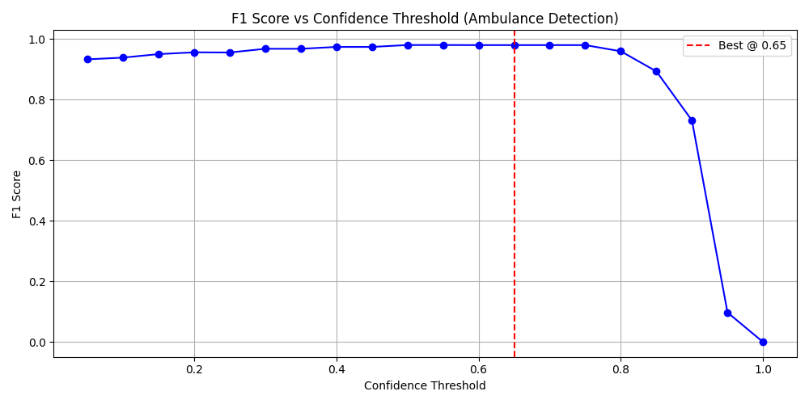

# Smart Traffic Monitoring System

## 🚦 Overview

The Smart Traffic Monitoring System is an AI-powered traffic analysis solution that detects and prioritizes emergency vehicles to optimize traffic flow at intersections. The system uses computer vision and deep learning to identify vehicles, detect ambulances with high accuracy, and implement intelligent traffic signal control with emergency override capabilities.

## 🌟 Key Features

- **Real-time vehicle detection** using YOLO (You Only Look Once) models
- **Emergency vehicle prioritization** with automatic traffic signal override
- **Traffic flow analysis** with density classification and congestion metrics
- **WhatsApp alert system** for emergency notifications
- **Interactive dashboard** with visualization of traffic metrics
- **Lane simulation** for predictive traffic management
- **High-accuracy ambulance detection** (F1-score: 0.9806 at 0.65 confidence threshold)

## 📊 Technical Architecture

The system integrates several AI components:

- **YOLOv8** for general vehicle detection
- **Custom-trained YOLO model** for emergency vehicle detection
- **DeepSORT algorithm** for vehicle tracking across frames
- **Streamlit** for interactive dashboard visualization

## 🔧 Installation & Setup

### Requirements

#### Hardware Requirements
- **Recommended:** GPU with CUDA support for real-time processing
- **Alternative:** CPU-only mode available for deployment scenarios with reduced performance

### Prerequisites

```bash
# Clone the repository
git clone https://github.com/your-username/smart-traffic-monitoring.git
cd smart-traffic-monitoring

# Install dependencies
pip install -r requirements.txt
```

## 🚀 Running the System

```bash
# Start the Streamlit dashboard
streamlit run app.py

# For command-line processing
python traffic_monitor.py --input video_file.mp4 --output results/
```

## 📑 Understanding Ambulance Detection Performance

### Confidence Threshold Selection



**Graph explanation:** The above image shows how confidence threshold affects F1-score for ambulance detection. The graph demonstrates that a confidence threshold of 0.65 yields an optimal F1-score of 0.9806, providing the best balance between precision and recall.

The confidence threshold of 0.65 was selected after careful analysis of model performance metrics:

| Confidence Threshold | Precision | Recall | F1-Score |
|---------------------|-----------|--------|----------|
| 0.25                | 0.9532    | 0.9710 | 0.9620   |
| 0.45                | 0.9718    | 0.9690 | 0.9704   |
| **0.65**            | **0.9820**| **0.9793** | **0.9806** |
| 0.85                | 0.9902    | 0.9217 | 0.9549   |

At the 0.65 threshold:
- False positives are minimized without sacrificing detection rate
- Emergency response time is optimized through quick and accurate detection
- System reliability peaks with minimal false alerts

The F1-score of 0.9806 represents an excellent balance of precision and recall, ensuring the system reliably detects real ambulances while minimizing false alarms that would unnecessarily disrupt traffic flow.

## 🔄 System Workflow

1. **Video Input:** Process traffic camera feed or video file
2. **Vehicle Detection:** Identify all vehicles in the frame using YOLOv8
3. **Emergency Detection:** Detect ambulances with the custom model using 0.65 confidence threshold
4. **Traffic Analysis:** Calculate vehicle density, speed, and congestion metrics
5. **Smart Control:** Dynamically informs traffic signals timing based on traffic flow
6. **Emergency Override:** Immediately switch all signals to green when ambulances are detected
7. **Alert System:** Send notifications to traffic authorities via WhatsApp

## 📱 Alert System

The system integrates with Twilio's API to send emergency alerts through WhatsApp when ambulances are detected, ensuring that traffic authorities are immediately notified for manual intervention if needed.

## 🔍 Analytics Capabilities

- Real-time vehicle counting and classification
- Traffic density trending and forecasting
- Emergency vehicle response time measurement
- Signal timing optimization based on traffic patterns
- Historical data analysis for infrastructure planning


## 🤝 Contributing

1. Fork the repository
2. Create a feature branch (`git checkout -b feature/amazing-feature`)
3. Commit your changes (`git commit -m 'Add amazing feature'`)
4. Push to the branch (`git push origin feature/amazing-feature`)
5. Open a Pull Request


## 🙏 Acknowledgements

- The YOLO team for the object detection framework
- The DeepSORT authors for the tracking algorithm
- The Streamlit community for the visualization tools
